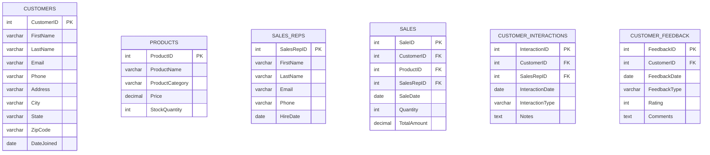

# 📊 Customer & Product Sales Tracking System

[](https://www.mysql.com/)
[](https://github.com)
[](LICENSE)

> A comprehensive database system for tracking customer relationships, product inventory, sales performance, and customer feedback analytics.


## 🎯 Overview

This project implements a robust relational database system designed to manage and analyze customer sales data, track product performance, monitor sales representative effectiveness, and gather customer feedback insights. Perfect for businesses looking to optimize their sales processes and improve customer satisfaction.

## ✨ Key Features

- **Customer Management**: Complete customer profile tracking with contact information and purchase history
- **Product Inventory**: Real-time product catalog with pricing and stock management  
- **Sales Analytics**: Comprehensive sales tracking with revenue analysis
- **Customer Interactions**: Detailed interaction logging for better customer service
- **Feedback System**: Rating and review system for continuous improvement
- **Sales Rep Performance**: Track individual sales representative metrics and success rates

## 🏗️ Database Architecture

### Entity Relationship Diagram




## 📋 Database Schema

### Core Tables

| Table | Description | Records |
|-------|-------------|---------|
| `Customers` | Customer profile and contact information | 10 sample records |
| `Products` | Product catalog with pricing and inventory | 10 sample records |
| `Sales_Reps` | Sales representative information | 10 sample records |
| `Sales` | Sales transactions and revenue tracking | 20 sample records |
| `Customer_Interactions` | Customer service interaction logs | 10 sample records |
| `Customer_Feedback` | Customer ratings and reviews | 10 sample records |

## 🚀 Quick Start

### Prerequisites
- MySQL 8.0 or higher
- MySQL Workbench (recommended) or any MySQL client

### Installation

1. **Clone the repository**
   ```bash
   git clone https://github.com/yourusername/customer-sales-tracking.git
   cd customer-sales-tracking
   ```

2. **Setup the database**
   ```bash
   mysql -u root -p < database_setup.sql
   ```

3. **Verify installation**
   ```sql
   USE Customer_and_Product_Sales_Tracking;
   SHOW TABLES;
   ```

## 📈 Sample Analytics Queries

The database comes with 6 pre-built analytical queries to extract business insights:

### 1. Top Purchasing Customers
```sql
SELECT C.CustomerID, C.FirstName, C.LastName, COUNT(S.SaleID) AS TotalPurchases
FROM Customers C
JOIN Sales S ON C.CustomerID = S.CustomerID
GROUP BY C.CustomerID, C.FirstName, C.LastName
ORDER BY TotalPurchases DESC;
```

### 2. Sales Rep Revenue Performance
```sql
SELECT SR.SalesRepID, SR.FirstName, SR.LastName, SUM(S.TotalAmount) AS TotalRevenue
FROM Sales_Reps SR
JOIN Sales S ON SR.SalesRepID = S.SalesRepID
GROUP BY SR.SalesRepID, SR.FirstName, SR.LastName
ORDER BY TotalRevenue DESC;
```

### 3. Product Rating Analysis
```sql
SELECT P.ProductID, P.ProductName, AVG(CF.Rating) AS AverageRating
FROM Products P
JOIN Sales S ON P.ProductID = S.ProductID
JOIN Customer_Feedback CF ON S.CustomerID = CF.CustomerID
GROUP BY P.ProductID, P.ProductName
ORDER BY AverageRating DESC;
```

### 4. Top Revenue Generating Products
```sql
SELECT P.ProductID, P.ProductName, SUM(S.TotalAmount) AS TotalRevenue
FROM Products P
JOIN Sales S ON P.ProductID = S.ProductID
GROUP BY P.ProductID, P.ProductName
ORDER BY TotalRevenue DESC;
```

### 5. Customer Interaction Patterns
```sql
SELECT InteractionType, COUNT(InteractionID) AS InteractionCount
FROM Customer_Interactions
GROUP BY InteractionType
ORDER BY InteractionCount DESC;
```

### 6. Sales Rep Customer Satisfaction
```sql
SELECT SR.SalesRepID, SR.FirstName, SR.LastName, AVG(CF.Rating) AS AverageRating
FROM Sales_Reps SR
JOIN Sales S ON SR.SalesRepID = S.SalesRepID
JOIN Customer_Feedback CF ON S.CustomerID = CF.CustomerID
GROUP BY SR.SalesRepID, SR.FirstName, SR.LastName
ORDER BY AverageRating DESC;
```

## 💼 Business Use Cases

- **Sales Management**: Track individual and team sales performance
- **Customer Relationship Management**: Maintain detailed customer interaction history
- **Inventory Management**: Monitor product stock levels and sales velocity
- **Performance Analytics**: Analyze sales rep effectiveness and customer satisfaction
- **Revenue Optimization**: Identify top-performing products and customer segments
- **Customer Service**: Track and resolve customer complaints and inquiries

## 🛠️ Technical Specifications

- **Database Engine**: MySQL 8.0+
- **Character Set**: UTF-8
- **Storage Engine**: InnoDB
- **Referential Integrity**: Foreign key constraints implemented
- **Data Validation**: Check constraints for ratings (1-5 scale)

## 📊 Sample Data Overview

The database includes realistic sample data:
- **10 Customers** across major US cities
- **10 Products** in Electronics and Accessories categories  
- **10 Sales Representatives** with varied experience levels
- **20 Sales Transactions** spanning multiple months
- **10 Customer Interactions** covering various interaction types
- **10 Customer Reviews** with ratings and detailed feedback
